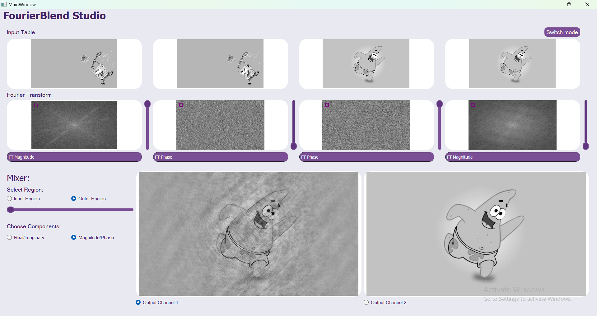
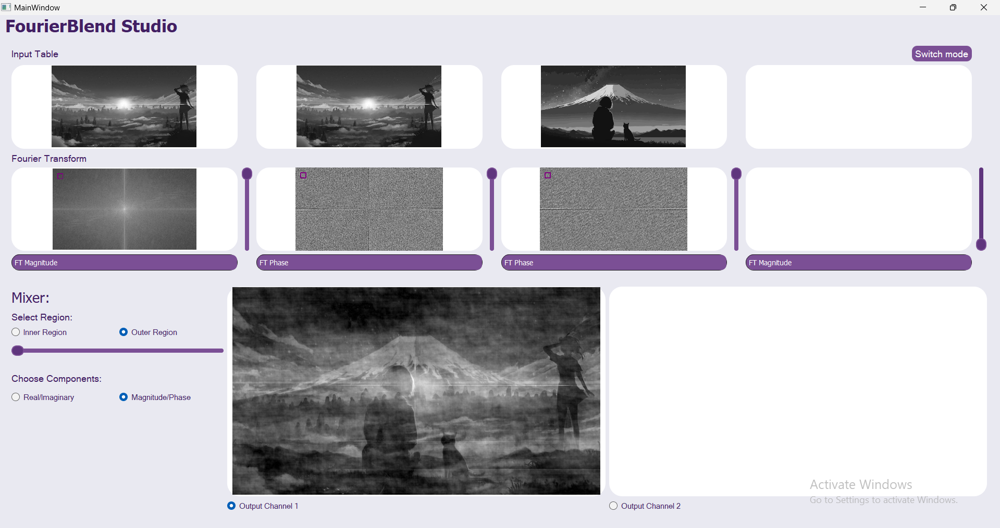
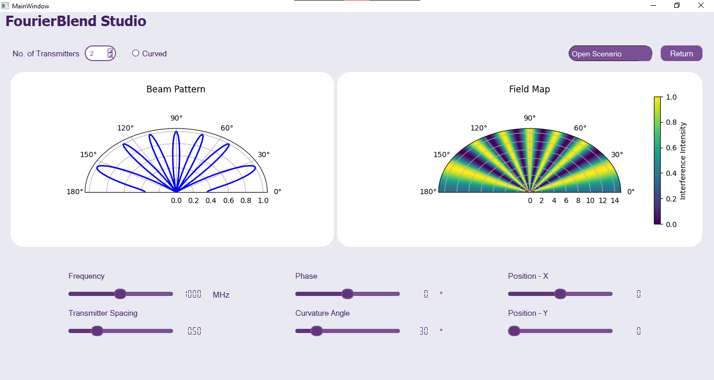
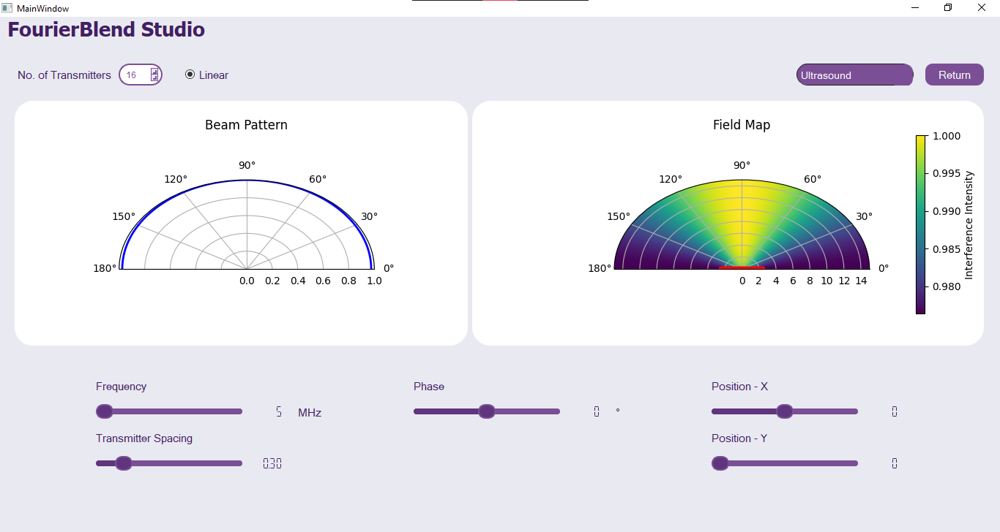
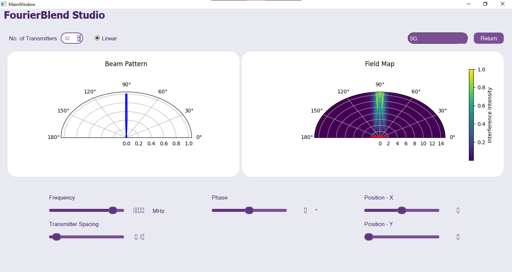
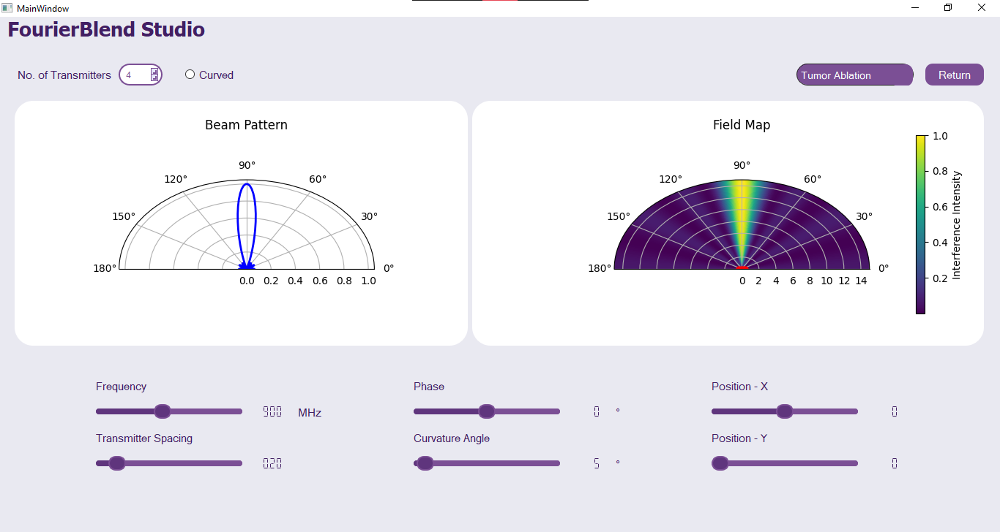
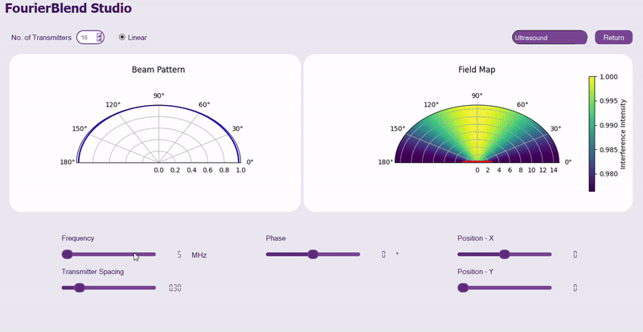

# Signal Processing and Beamforming Simulator

## Overview
This project includes two main parts: 

1. **FT Magnitude/Phase Mixer or Emphasizer**: A desktop program for exploring the relative importance of the magnitude and phase components in a 2D signal (image). The program allows users to mix different Fourier Transform (FT) components of images, apply weight adjustments, and visualize the impact of changes in real-time.
2. **Beamforming Simulator**: A 2D simulator designed to visualize and simulate the effect of beamforming, a key technology in modern wireless communication systems, radar, and biomedical applications. The simulator allows users to adjust system parameters such as delays, phase shifts, and array geometries to steer the beam and visualize the results.

## Table of Contents
1. [Overview](#overview)
2. [Features](#features)
   - [Part A: FT Magnitude/Phase Mixer or Emphasizer](#part-a-ft-magnitudephase-mixer-or-emphasizer)
   - [Part B: Beamforming Simulator](#part-b-beamforming-simulator)
3. [Installation](#installation)
    - [How to Run](#how-to-run)
4. [Usage](#usage)
   - [FT Magnitude/Phase Mixer](#ft-magnitudephase-mixer)
   - [Beamforming Simulator](#beamforming-simulator)
5. [Configuration](#configuration)
6. [Contributors](#contributors)

## Features

### Part A: FT Magnitude/Phase Mixer or Emphasizer


https://github.com/user-attachments/assets/36effe15-a067-471a-8d64-0d27a2c93cd1


1. **Image Viewer**:
   - Open and view four grayscale images.
   - Convert colored images to grayscale if needed.
   - Unified image sizes for comparison.
   - Display Fourier Transform (FT) components (magnitude, phase, real, imaginary).
   - Easy browsing: Double-click any viewer to change the image.
   - Brightness/contrast adjustment for each image viewport.

2. **Components Mixer**:
   - Perform inverse FT (ifft) of weighted averages of the FT components of the input images.
   - Customizable weights via sliders for intuitive user control.

3. **Regions Mixer**:
   - Select regions of interest for FT components (low frequencies or high frequencies).
   - Draw and resize rectangles on FT displays to choose the regions.
<br>

<p>
   Selecting the low-frequency components of an image enables nearly complete reconstruction with high accuracy,
   demonstrating that the majority of the image's information resides in the low frequencies.
</p>


<br>

<p>Merging the phase of one image with the magnitude of another allows for the reconstruction of the image, retaining over 70% of its original information. This demonstrates that the phase component holds a significantly larger share of the image's information compared to the magnitude.</p>

  

<br>

<p>Combining two images using just three components (two phases and one magnitude) enables overlaying the images.</p>
  
    
<br>

---

### Part B: Beamforming Simulator
  

1. **Customization of Parameters**:
   - Customize system parameters: number of transmitters/receivers, delays/phase shifts, operating frequencies.
   - Adjust the geometry of the phased array (linear or curved arrays with customizable curvature).

2. **Visualization**:
   - Display constructive/destructive interference maps.
   - Visualize the beam profile and its direction in real-time.
   - Synchronized multiple viewers for a comprehensive view of the system.

3. **Scenario Management**:
   - Load and customize predefined scenarios inspired by applications in 5G, ultrasound, and tumor ablation.
   - Fine-tune the parameters and visualize the effects of different configurations.

      
      
      
   
#### DEMO

  


## Installation

 ### How to Run
1. Clone this repository:
   ```bash
   git clone https://github.com/hassnaa11/Emphasizer-and-Beamforming.git
   ```
2. Install dependencies:
   ```bash
   pip install -r requirements.txt
   ```
3. Run the application:
   ```bash
   python program.py
   ```

## Usage

### FT Magnitude/Phase Mixer

1. **Opening Images**:
   - Click on any of the image viewers to browse and open an image.
   - If the image is colored, it will be automatically converted to grayscale.
   - The images will be resized to the smallest size among them for consistent comparison.

2. **Viewing Fourier Transform Components**:
   - Use the combo-box/dropdown menu to choose the FT component to display: FT Magnitude, FT Phase, FT Real, or FT Imaginary.
   - Adjust brightness and contrast by dragging the mouse across the image.

3. **Mixing Components**:
   - Use the sliders to customize the weights for each image's FT components.
   - Choose the region (inner or outer) for mixing by drawing rectangles on the FT images.
   - Click "Mix" to apply the changes and see the resulting image in the output viewports.

4. **Real-Time Mixing**:
   - The program will display a progress bar during the ifft operation.
   - If a new operation is requested while another is still processing, the previous operation will be canceled, and the new one will begin.


### Beamforming Simulator

1. **Customize Parameters**:
   - Adjust system parameters like the number of transmitters/receivers, delays/phase shifts, and operating frequencies.
   - Customize the array geometry (linear or curved) with real-time updates.

2. **Visualizing Beamforming**:
   - Visualize constructive and destructive interference maps.
   - Adjust the beam direction and view the beam profile in real-time.

3. **Scenario Settings**:
   - Open predefined scenarios and fine-tune their parameters.
   - Explore scenarios inspired by 5G, ultrasound, and tumor ablation applications.


## Configuration

- **Scenario Files**:
  - The simulator comes with three predefined scenarios. These can be loaded through the “Open Scenario” menu and customized in real-time.

- **Customizing Parameters**:
  - For both the FT mixer and beamforming simulator, you can adjust various settings through intuitive graphical user interfaces (GUIs) with sliders, combo-boxes, and buttons.


## Contributors 

<table align="center" width="100%">
  <tr>
    <td align="center" width="20%">
      <a href="https://github.com/yasmine-msg79">
        
      </a>
      <br />
      <a href="https://github.com/yasmine-msg79">Yasmine Mahmoud</a>
    </td>
    <td align="center" width="20%">
      <a href="https://github.com/hassnaa11">
        
      </a>
      <br />
      <a href="https://github.com/hassnaa11">Hassnaa Hossam</a>
    </td>
    <td align="center" width="20%">
      <a href="https://github.com/shahdragab89">
        
      </a>
      <br />
      <a href="https://github.com/shahdragab89">Shahd Ragab</a>
    </td>
   <td align="center" width="20%">
      <a href="https://github.com/Emaaanabdelazeemm">
        
      </a>
      <br />
      <a href="https://github.com/Emaaanabdelazeemm">Eman Abdelazeemm</a>
    </td>
   <td align="center" width="20%">
      <a href="https://github.com/Ayat-Tarek">
        
      </a>
      <br />
      <a href="https://github.com/Ayat-Tarek">Ayat Tarek</a>
    </td>
  </tr>
</table>
